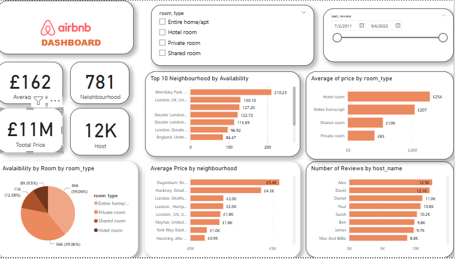

# Airbnb-Dashboard
 
 Airbnb Data Analysis &amp; Visualization | Power BI Dashboard This project explores Airbnb listing trends, including pricing, availability, and neighborhood insights. The dataset was cleaned and transformed before creating an interactive Power BI dashboard to visualize key patterns

## Project Overview  
This project explores **Airbnb listing trends**, including pricing, availability, and neighborhood insights. The dataset was cleaned and transformed before creating an interactive Power BI dashboard to visualize key patterns.

##  Problem Statement  
The short-term rental market is highly dynamic, with prices, availability, and customer preferences constantly shifting. This analysis aims to answer key questions such as:
- Which neighborhoods have the highest number of Airbnb listings?
- What factors influence pricing trends?
- How does availability vary across different regions?
- Which hosts have the most listings and reviews?

## Dataset Description  
- The dataset consists of **Airbnb listings** with details such as host information, pricing, location, availability, and reviews.
- The data was preprocessed to remove duplicates, handle missing values, and standardize formats.

## Tools Used  
- **Power BI** – Data visualization
- **Power Querry** Data cleaning
- **Excel** 
  

## Data Cleaning 
Before building the dashboard, I performed the following data cleaning steps: 
✅ Removed unnecesary columns
✅ Removed duplicate listings  
✅ Handled missing values in price and review columns  
✅ Standardized date formats  
✅ Filtered outliers in price distributions  

*Example screenshot:*  
  

## Key Insights 
Here are some insights from the analysis:  
- **Hotel rooms have the highest average price ($254/night).**  
- **Wembley Park has the most available listings (210).**  
- **Private rooms are the most common type of listing.**  
- **Hosts with more reviews tend to have lower prices.**  
  
  

## Power BI Dashboard   
The dashboard consists of multiple visuals, including:  
- **Price distribution by room type**  
- **Availability trends**  
- **Review counts by host**  

Download the Power BI file here: [Dashboard.pbix](AirBNB.pbix)  

## How to Use This Repository   
1. Clone or download this repository.  
2. Open **Dashboard.pbix** in Power BI.  
3. Explore the dataset and interactive visualizations.  

## Contact   
If you have questions, feel free to connect with me on **[LinkedIn](https://www.linkedin.com/in/ezinneesther/)** or email me at **ezinnemadukairo@gmail.com**.  
